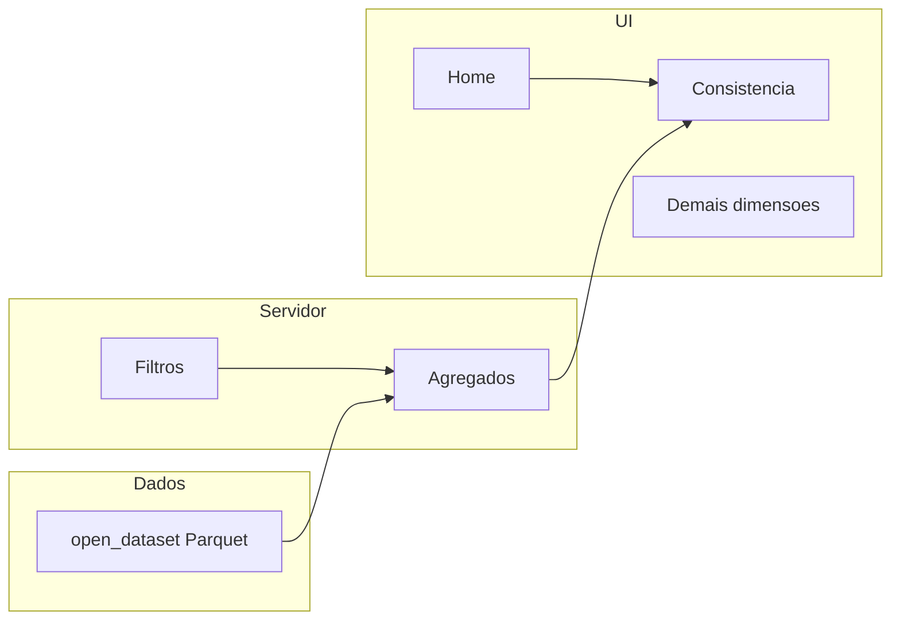

# Painel IQD RNDS — esqueleto Shiny (Consistência)

## O que já está definido pelos materiais

- **Onde criar o código:** subpasta [`painel_iqd/`](painel_iqd/) (não misturar com insumos).
- **Bases:** Parquet particionado em [`dados_intermediarios_iqd_07082026/dados_intermediarios/`](dados_intermediarios_iqd_07082026/dados_intermediarios/) (`ria_r`, `ra`, `rel`), descritos em [`readme_uso_base_intermediario.md`](readme_uso_base_intermediario.md) e [`dicionario_dados_bases_intermediarias.xlsx`](dicionario_dados_bases_intermediarias.xlsx).
- **Consistência (mapeamento seguro):** a coluna `dimensao_qualidade` vale **Consistência** para todos os indicadores do pipeline. Indicadores **presentes nos dados:**
  - **i001** (RIA-R, RA, REL): CNES estruturalmente válido (`^[1-9][0-9]{6}$`)
  - **i002** (RIA-R, RA, REL): `dt_entrada_rnds >= dt_evento`
  - **i018** (**somente RIA-R**): idade calculada igual a `nu_idade_paciente`
- **Não inventar:** IQD composto, média de percentuais, faixas “Excelente/Bom/Regular”, treemap com 57 mil CNES, geometrias ausentes. O PPTX em [`design_dash/Modelo_Dashboard_hoje.pptx`](design_dash/Modelo_Dashboard_hoje.pptx) vale como **arquitetura da informação** (Home radial + página de dimensão), não como números nem estética.

## Árvore do projeto

```text
painel_iqd/
├── app.R
├── renv.lock                 # se renv estiver disponível; senão, lista no README
├── config/config.yml
├── config/catalogo.yml       # dimensões, indicadores, textos das fichas (sem inventar)
├── R/
│   ├── 00_global.R
│   ├── theme.R
│   ├── data_access.R
│   ├── data_processing.R
│   ├── indicators.R
│   ├── utils.R
│   ├── mod_header.R
│   ├── mod_nav.R
│   ├── mod_filters.R
│   ├── mod_home.R
│   ├── mod_dimensao.R        # template único (Consistência + placeholders)
│   ├── mod_kpis.R
│   ├── mod_series_temporais.R
│   ├── mod_comparacao_geo.R
│   ├── mod_cnes.R
│   ├── mod_mapa.R
│   ├── mod_tabela_investigacao.R
│   └── mod_ficha.R
├── www/custom.css
└── README.md
```

`app.R` só orquestra `bslib::page_sidebar` (ou equivalente Bootstrap 5): cabeçalho, nav lateral recolhível, área principal. Sem `shinydashboard`.



## Decisões técnicas (não negociáveis nesta entrega)

**Cálculo.** Função única `calcular_indicador()`: `sum(numerador) / sum(denominador) * 100`. Nunca `mean(percentual)`. Denominador 0 ou NA → resultado `NA` e estado de UI “sem dados”. Geografia nula permanece no total Brasil e aparece como “Não identificado” nas quebras.

**IQD e resultado da dimensão.** Não há fórmula oficial de composição. Home: IQD central **sem número** (“Indicador em definição”). KPI “Dimensão de Qualidade” na página Consistência: mesmo placeholder. Só os indicadores primários (i001, i002, i018 quando o modelo for RIA-R) terão valores.

**Classificação qualitativa.** Ausente nos dicionários/fichas como faixas numéricas. Não exibir “Excelente”. Documentar pendência no README.

**Nº absoluto.** `SUM(denominador)` do **i001** (universo de registros finais com `dt_entrada_rnds` válida), com tooltip explicando a escolha. Não misturar denominadores de i001/i002/i018.

**CNES.** Alta cardinalidade (~57k no RIA-R). **Não usar treemap** nesta versão: barras horizontais dos N piores/melhores + tabela pesquisável. Finalidade preservada (análise por estabelecimento). Decisão no README.

**Mapa.** Não há GeoJSON/shapefile no repositório. `mod_mapa` com estado “Indicador em definição” + nota do que falta (malhas IBGE UF/município, chave IBGE 6 dígitos = `co_municipio_ocorrencia`).

**Fichas.** Conteúdo só de i001, i002 e i018 extraído das `.docx` em [`Fichas de Requisitos dos Indicadores/`](Fichas%20de%20Requisitos%20dos%20Indicadores/) para `catalogo.yml` (conceituação, interpretação, usos, limitações, fonte, método, categorias). Modal “Sobre o indicador”. Sem preencher seções vazias.

**Leitura Arrow.** `arrow::open_dataset()` por modelo; `dplyr` filter/group/summarise **antes** de `collect()`. Union dos três modelos só depois do filtro de `modelo_informacional`, ou dataset já filtrado. Uma consulta agregada alimenta KPIs, série e barras geo; CNES e tabela são consultas à parte (Top N / grain escolhido). Caminhos só em `config.yml` relativos à raiz do workspace.

**Filtros.** Objeto reativo único. Tempo: ano, mês, semestre (derivado de `mes`: 1–6 / 7–12). Geo hierárquica: Região → UF → Município. MI. CNES via `selectize` (busca) preferencialmente após município/UF, para não carregar 57k opções. Botão “Filtros” (offcanvas/painel compacto), chips dos ativos, Limpar / Aplicar.

## UI / design system

- Tema `bslib` + CSS com variáveis (`--primary` verde institucional, `--background` cinza muito claro, `--surface` branco, texto/borda/sucesso/alerta). Zero hex solto nos módulos.
- Cabeçalho baixo: nome do painel + última atualização (`max(dt_processamento)` coletado uma vez na inicialização) + botão metodologia.
- Nav: Visão Geral + 9 dimensões, ícones `bsicons`, item ativo destacado, colapsável no mobile.
- Home: IQD circular minimalista (HTML/CSS, sem gauge) cercado pelas 9 dimensões em composição tipo “mapa da qualidade”; cards clicáveis (`updateNavbarPage` / input de navegação sem reload). Consistência mostra os % reais; as outras, “Indicadores em definição”.
- Página-template: breadcrumb, título, descrição curta, KPIs dinâmicos (`uiOutput` a partir do catálogo + dados), série (`plotly`), comparação regional (`plotly` barras, linha Brasil), CNES, mapa (esqueleto), `reactable` de investigação (agrupamentos no grain atual, ordenados pelo percentual, com numerador/denominador; sem PII — a base intermediária não tem identificadores pessoais).
- Estados: skeleton, “Não há dados…”, “Indicador em definição.”, erro amigável (detalhe só no log).
- Formatação `pt_BR` via `scales`. Gráficos sem título interno se o card já tiver título.

## Fases de implementação (ordem do prompt)

1. Catálogo YAML + `config.yml` + `calcular_indicador()` + camada `data_access`.
2. Design system (`theme.R` + `www/custom.css`) e shell (header + sidebar).
3. Home navegável com placeholders corretos e Consistência com valores.
4. `mod_dimensao` genérico; Consistência ligada aos Parquet; demais páginas só esqueleto.
5. Filtros hierárquicos + reativos derivados.
6. Série, barras geo, CNES, tabela, ficha modal, mapa placeholder.
7. Revisão de vazios, performance (`bindCache` nas agregações estáveis) e README.

## README (decisões a registrar)

Objetivo; árvore; como apontar os Parquet; pacotes e `shiny::runApp("painel_iqd")`; indicadores implementados vs pendentes (fichas i003–i024 fora do parquet, i015 excluído); regra SUM/SUM; por que não há IQD/faixas/treemap/mapa ativo; próximas etapas (metadados, demais dimensões, geometrias, classificação, testes, homologação).

## Risco de ambiente

Nesta máquina, `Rscript` não está no PATH. A entrega será código executável; a verificação de “abre sem erro” depende de R 4.x + pacotes (`shiny`, `bslib`, `bsicons`, `dplyr`, `tidyr`, `arrow`, `purrr`, `stringr`, `lubridate`, `scales`, `plotly`, `leaflet`, `reactable`, `config`) instalados no momento da implementação.
